# Design Document: Parameter Adapter and Router Architecture Refactoring
*Generated: 2025-01-23 13:37:05 UTC*  
*Author: @bohdan-shulha*  
*Status: Draft for Review*

## Executive Summary

This design addresses architectural inconsistencies in Gork's parameter adapter hierarchy and router group management. The refactoring eliminates interface duplication, clarifies naming conventions, and enforces proper separation of concerns by making group management an adapter-level responsibility.

**Key Changes:**
- Remove `ParameterAdapter` interface (redundant with `GenericParameterAdapter[*http.Request]`)
- Rename `RequestParamAdapter` → `HTTPParameterAdapter` 
- Remove `TypedRouter.Group()` method to enforce framework-specific group management
- Establish clear adapter hierarchy with `GenericParameterAdapter[T]` as primary interface

## Current State Analysis

Based on git analysis and codebase review:

### Existing Issues
1. **Interface Duplication**: Three overlapping interfaces create cognitive overhead
2. **Naming Confusion**: `RequestParamAdapter` vs `ParameterAdapter` unclear hierarchy
3. **Group Management Anti-Pattern**: `TypedRouter.Group()` provides simplistic default instead of leveraging framework capabilities
4. **Framework Integration**: Adapters should use native group features (gin.RouterGroup, echo.Group, etc.)

### Current Architecture
```
GenericParameterAdapter[T] ← Primary interface for framework contexts
ParameterAdapter          ← Duplicates GenericParameterAdapter[*http.Request] 
RequestParamAdapter       ← Base implementation (confusing name)
```

## Problem Statement

### Core Issues
1. **Parameter Adapter Confusion**: Three interfaces (`ParameterAdapter`, `RequestParamAdapter`, `GenericParameterAdapter[T]`) create unclear hierarchy
2. **TypedRouter Group Anti-Pattern**: Default Group() implementation discourages framework-native group usage
3. **Separation of Concerns**: Core routing logic mixed with framework-specific group management

**Success Metrics**: 
- Single clear parameter adapter hierarchy
- Framework-specific group management
- Reduced cognitive complexity
- Maintained backward compatibility

## Proposed Solution

### Architecture Diagram

```mermaid
graph TB
    subgraph "Core Interfaces"
        GPA[GenericParameterAdapter&#91;T&#93;]
        HPA[HTTPParameterAdapter]
    end
    
    subgraph "HTTP-based Adapters"
        GPA --> HPA
        HPA --> Chi[ChiAdapter]
        HPA --> Gorilla[GorillaAdapter] 
        HPA --> Stdlib[StdlibAdapter]
    end
    
    subgraph "Native Context Adapters"
        GPA --> Gin[GinAdapter&#91;*gin.Context&#93;]
        GPA --> Fiber[FiberAdapter&#91;*fiber.Ctx&#93;]
        GPA --> Echo[EchoAdapter&#91;echo.Context&#93;]
    end
    
    subgraph "Router Management"
        Router[Router Interface] --> Routers[Framework Routers]
        Routers --> GinR[GinRouter]
        Routers --> FiberR[FiberRouter]
        Routers --> EchoR[EchoRouter]
    end
    
    subgraph "Group Management"
        GinR --> GinGroup[gin.RouterGroup]
        FiberR --> FiberGroup[fiber.Group]
        EchoR --> EchoGroup[echo.Group]
    end
```


### Key Design Decisions

| **Decision** | **Rationale** | **Impact** |
|-------------|---------------|------------|
| Remove `ParameterAdapter` interface | Duplicates `GenericParameterAdapter[*http.Request]` | Eliminates confusion, cleaner hierarchy |
| Rename `RequestParamAdapter` → `HTTPParameterAdapter` | Clearly indicates HTTP request base implementation | Better naming consistency |
| Remove `TypedRouter.Group()` | Forces framework-native group management | Proper separation of concerns |
| Keep `GenericParameterAdapter[T]` primary | Clean abstraction for framework contexts | Supports both HTTP and native contexts |

## Implementation Details

### Core Components

#### 1. Simplified Parameter Adapter Hierarchy
```go
// Primary interface - supports any context type
type GenericParameterAdapter[T any] interface {
    Path(ctx T, key string) (string, bool)
    Query(ctx T, key string) (string, bool)
    Header(ctx T, key string) (string, bool)
    Cookie(ctx T, key string) (string, bool)
}

// Base implementation for HTTP request adapters
type HTTPParameterAdapter struct{}

func (HTTPParameterAdapter) Query(r *http.Request, k string) (string, bool) {
    v := r.URL.Query().Get(k)
    return v, v != ""
}

func (HTTPParameterAdapter) Header(r *http.Request, k string) (string, bool) {
    v := r.Header.Get(k)
    return v, v != ""
}

func (HTTPParameterAdapter) Cookie(r *http.Request, k string) (string, bool) {
    if c, _ := r.Cookie(k); c != nil {
        return c.Value, true
    }
    return "", false
}

// Path panics by default - adapters must override
func (HTTPParameterAdapter) Path(_ *http.Request, _ string) (string, bool) {
    panic("Path extraction not implemented; adapter must override HTTPParameterAdapter.Path")
}
```

#### 2. Framework-Specific Adapter Implementations
```go
// Chi adapter - embeds HTTPParameterAdapter, overrides Path
type chiParamAdapter struct{ HTTPParameterAdapter }

func (chiParamAdapter) Path(r *http.Request, k string) (string, bool) {
    return chi.URLParamFromCtx(r.Context(), k), true
}

// Gin adapter - uses native context directly
type ginParamAdapter struct{}

func (ginParamAdapter) Path(c *gin.Context, k string) (string, bool) {
    return c.Param(k), true
}

func (ginParamAdapter) Query(c *gin.Context, k string) (string, bool) {
    v, exists := c.GetQuery(k)
    return v, exists
}
// ... other methods
```

#### 3. TypedRouter Changes
```go
// REMOVE this method entirely from TypedRouter
// func (r *TypedRouter[T]) Group(prefix string) *TypedRouter[T] {
//     // This method will be DELETED
// }

// Adapters handle groups using framework-specific capabilities:

// Gin Router
func (r *GinRouter) Group(prefix string) *GinRouter {
    var g *gin.RouterGroup
    if r.group != nil {
        g = r.group.Group(prefix)
    } else {
        g = r.engine.Group(prefix)
    }
    
    return &GinRouter{
        engine:   r.engine,
        group:    g,
        registry: r.registry, // Shared registry
        // ... framework-specific setup
    }
}

// Chi Router  
func (r *ChiRouter) Group(prefix string) *ChiRouter {
    // Use chi.Route for sub-routing
    subrouter := chi.NewRouter()
    r.mux.Mount(prefix, subrouter)
    
    return NewRouter(subrouter, r.CopyMiddleware()...)
}
```

### Data Access Pattern

Based on project memory, the codebase uses runtime registration patterns:

1. **Route Registration**: Adapters register routes with metadata in instance registries
2. **Parameter Extraction**: Framework-specific adapters extract parameters using native methods
3. **Group Management**: Each adapter uses framework-native grouping capabilities
4. **Registry Sharing**: Sub-routers share parent registry for OpenAPI generation

### External Dependencies

- **Chi**: Native `{param}` syntax, uses `chi.URLParamFromCtx`
- **Gin**: RouterGroup for native groups, `gin.Context` for parameters  
- **Echo**: Group middleware, echo.Context for parameter access
- **Fiber**: High-performance `*fiber.Ctx`, native Group() method
- **Gorilla**: `mux.Vars()` for parameters, `PathPrefix().Subrouter()` for groups

## Risk Analysis

| Risk | Impact | Mitigation | Reference |
|------|---------|------------|-----------|
| Breaking changes in adapter interfaces | High | Phased migration with deprecation warnings | Existing TypedRouter patterns |
| Group() removal disrupts current usage | Medium | Documentation of framework-specific patterns | Framework adapter implementations |
| Parameter extraction performance impact | Low | Benchmark existing vs new implementations | Current adapter test coverage |
| Migration complexity for existing code | Medium | Automated migration scripts and clear guides | Project refactoring history |

## Implementation Roadmap

### Phase 1: Interface Cleanup (2-3 days)
- [ ] Remove `ParameterAdapter` interface from codebase
- [ ] Rename `RequestParamAdapter` → `HTTPParameterAdapter` 
- [ ] Update all adapter implementations to use new naming
- [ ] Update imports and references across adapters
- [ ] Add deprecation warnings for old interface names

### Phase 2: TypedRouter Refactoring (3-4 days)
- [ ] Remove `Group()` method from TypedRouter struct
- [ ] Update adapter Group() implementations to use framework-specific features
- [ ] Ensure registry sharing works correctly in sub-routers
- [ ] Add comprehensive documentation for group patterns per framework
- [ ] Update examples to show proper group usage

### Phase 3: Testing and Validation (2-3 days)
- [ ] Update all adapter unit tests
- [ ] Add integration tests for group functionality
- [ ] Performance benchmarks for parameter extraction
- [ ] Validate OpenAPI generation with groups
- [ ] End-to-end testing with example applications

### Phase 4: Documentation and Migration (1-2 days)
- [ ] Update README and adapter documentation
- [ ] Create migration guide for existing users
- [ ] Add framework-specific group examples
- [ ] Update API reference documentation
- [ ] Create troubleshooting guide for common issues

## Success Criteria

- [ ] Single clear parameter adapter hierarchy with `GenericParameterAdapter[T]`
- [ ] No interface duplication or naming confusion
- [ ] Framework-specific group management working correctly
- [ ] All existing functionality preserved after migration
- [ ] Performance maintained or improved
- [ ] Clean separation between core routing and framework features
- [ ] Comprehensive test coverage for new architecture
- [ ] Clear documentation for migration and usage patterns

## Alternative Approaches Considered

### TypedRouter as Interface
**Considered**: Making TypedRouter an interface instead of concrete type
**Decision**: Keep as concrete type for now
**Rationale**: Current embedding approach works well; interface conversion can be future enhancement

### Keep ParameterAdapter Interface
**Considered**: Maintaining ParameterAdapter alongside GenericParameterAdapter
**Decision**: Remove to eliminate duplication
**Rationale**: GenericParameterAdapter[*http.Request] provides identical functionality

### Gradual Group() Deprecation
**Considered**: Deprecate TypedRouter.Group() instead of immediate removal
**Decision**: Remove immediately
**Rationale**: Clean break prevents continued anti-pattern usage

## References

- [Parameter Adapter Design Proposal](../proposals/PARAMETER_ADAPTER_DESIGN.md)
- [Go Interface Design Patterns](https://golang.org/doc/effective_go.html#interfaces)
- Memory Entity: Gork_Parameter_Adapter_Architecture_Issues
- Memory Entity: Gork_TypedRouter_Group_Design_Issue
- Codebase Analysis: Current adapter implementations in `pkg/adapters/`

## Revision History

- **2025-01-23**: Initial draft by @bohdan-shulha
- **Status**: Draft - awaiting team review
- **Next Steps**: Technical review, implementation planning, stakeholder approval

---

## Implementation Notes

### Migration Script Outline
```bash
#!/bin/bash
# Automated migration helper

# 1. Replace interface names
find . -name "*.go" -exec sed -i 's/RequestParamAdapter/HTTPParameterAdapter/g' {} \;
find . -name "*.go" -exec sed -i 's/ParameterAdapter interface/GenericParameterAdapter[*http.Request]/g' {} \;

# 2. Remove Group() method calls to TypedRouter
# Manual review required for proper framework-specific replacement

# 3. Update imports
goimports -w ./pkg/adapters/...
```

### Framework-Specific Group Examples
```go
// Gin - leverages RouterGroup
v1 := router.Group("/api/v1")
v1.Use(authMiddleware)
v1.Get("/users", getUsers)

// Echo - uses Group with middleware  
api := router.Group("/api", authMiddleware)
api.Get("/users", getUsers)

// Chi - uses Route for sub-routing
router.Route("/api", func(r chi.Router) {
    r.Use(authMiddleware)
    r.Get("/users", getUsers)
})
```

This refactoring aligns with Go's interface design principles and the project's runtime registration patterns, providing a cleaner architecture while maintaining full functionality.
